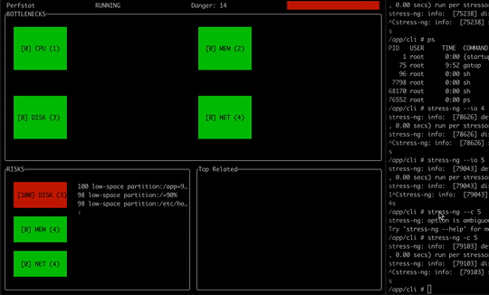
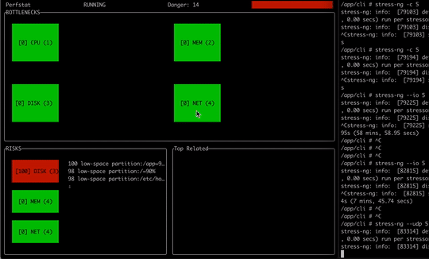
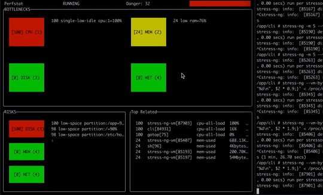

# perfstat

Analyze and show tips about possible bottlenecks and risks in Linux systems regarding to diskio, networking, cpu, swapping, memory etc.

We decided to create this utility to help on the laborious job of aswering the following:

* "Is the system OK?"
* "Will it be OK?"
* "Do we have to do anything now?"

After hundred of hours looking for metrics on CLI and Prometheus/Grafana tools, correlating data to check if all is ok, now we can automate some of this work. Surely this won't answer all the doubts, but can help you on some repetitive work.

**If you are a system admin**, answering the "Is the system OK" overnight too, come and tell us what you miss from perfstat on the [Issues](https://github.com/flaviostutz/perfstat/issues). Share your experience and automate it forever!

**If you are a developer** too, help system admins find problems more quickly by implementing some of the [Issues](https://github.com/flaviostutz/perfstat/issues) so they can keep your software up! If in doubt, ask for a task in "Issues" and we'd be glad to answer.

* CPU related issues




* Disk related issues


* Network related issues




* Memory related issues




Perfstat has various interfaces:

* **CLI**: ```perfstat``` - for local diagnostics
* **Prometheus Exporter**: ```perfstat --prom-enable``` - for remote monitoring
* **Golang lib**: ```go get github.com/flaviostutz/perfstat``` - for using this in something greater

## Usage

### CLI

```sh
perfstat
```

Output

```sh
```

### Prometheus Exporter

* Start exporter

```sh
perfstat prometheus
```

* Check metrics

```sh
curl localhost:8880/metrics
```

* Add this exporter to Prometheus configuration

#### Prometheus Metrics

* **danger_level** - overall danger levels
	* label "type" - bottleneck or risck
	* label "group" - subsystem: net, disk, mem, cpu

  * label resource - cpu, mem, disk, net
  * label name - cpu:1, disk-/mnt/test, nic:eth0

* **issue_score** - independent issues score
	* label "type" - bottleneck or risck
	* label "group" - subsystem: net, disk, mem, cpu
	* label "id" - issue identification
	* label "resource_name" - name of the resource that was used during issue detection
	* label "resource_property_name" - property analysed
	* label "related_resource_name" - secondary (maybe the a root cause) related to the issue

* **issue_resource_value** - mem perc for active issues
	* label "type" - bottleneck or risck
	* label "group" - subsystem: net, disk, mem, cpu
	* label "id" - issue identification
	* label "resource_name" - name of the resource that was used during issue detection
	* label "resource_property_name" - property analysed

## Issue Detectors

### Bottlenecks (already a problem)

* Low idle CPU (overall) OK TESTED
  * top cpu eater processes OK
  * high steal cpu OK
* Low idle CPU (single CPU) OK TESTED
  * top cpu eater processes OK
* High CPU wait (waiting for IO) OK TESTED
  * top io waiter processes OK
  * top "waited" disks OK
* Disk nr of block read/writes seems to be in a ceil limit OK TESTED
  * top disk eater processes OK
* Disk bandwidth of read/writes seems to be in a ceil limit OK TESTED
  * top disk eater processes OK
* Network interface bandwidth seems to be in a ceil limit OK TESTED
  * top network bandwidth eater processes OK
* Network interface pps seems to be in a ceil limit OK TESTED
  * top network pps eater processes OK

### Risks (may cause problems)

* Low RAM OK TESTED
  * top ram eater processes OK
* Low Disk space OK TESTED
  * mapped device with lowest space OK
* Low Disk inodes OK TESTED
  * mapped device with lowest inodes OK
* Low available open files descriptors OK TESTED
  * top process by open files OK
* RAM memory growing linearly for process - there maybe a memory leak OK
  * process with growing memory OK
* High error rate in NIC OK
  * show processes with most net errors OK
* High swap IO OK
  * Top process with swap OK
  * "Few RAM, may slow down system by using too much disk"
* High %util in disk - disk is being hammered and may not handle well spikes when needed OK TESTED
  * show processes with high disk util OK

### Insights (top 5)

* Processes with high cpu wait
* Processes with high cpu usage
* Processes with high disk io
* Processes with high nr of open files
* Processes with high network usage
* Destination hosts with high network bandwidth
* Block devices with high reads/writes

## Perfstat developer tips

### Profiling

```golang
//run profile for an specific test case
go test -cpuprofile /tmp/cpu.prof -run ^TestProcessStatsBasic$

//see results in browser
go tool pprof -http 0.0.0.0:5050 /tmp/cpu.prof
```
### CLI development

* Because of tty characteristics, running CLI using ```docker-compose up``` won't work
* Use command=sleep 9999 and mount source volume to container (as in docker-compose.yml) and than run

```docker exec -it [containerid] sh```

```sh
cd /app
go run .
```

## Existing tools for performance analysis

* CPU stats by CPU (%idle %wait etc): mpstat -P ALL 2 5
* RAM stats (free, cache, buffer, swap): vmstat -S M 2
* Disk stats by block device (wr/s rd/s etc): iostat -dx 1
* Network bandwidth by host: iftop
* Open files by process: lsof
* CPU usage by process: top
* Disk usage by process: iotop
* Network bandwidth by process: nethogs OR iftop with netstat -tup OR dstat --net --top-io-adv

## More info about performance analysis

* https://blog.appsignal.com/2018/03/06/understanding-cpu-statistics.html
* https://www.cyberciti.biz/tips/linux-resource-utilization-to-detect-system-bottlenecks.html
* http://web.archive.org/web/20101028025942/https://anchor.com.au/hosting/development/HuntingThePerformanceWumpus
* https://www.tecmint.com/command-line-tools-to-monitor-linux-performance/
* https://www.netadmintools.com/art295.html

## CLI UI considerations

We are using some pointer reassignments due to inability to change some widgets characteristics after building the container graph. This is dangerous, but was the only way to change some visuals dynamically. 

Be aware of

```golang
	*h.memButton = *memButton2
	*h.memText = *memText2
```

because there are some mutex locks misplaced there. We used termdash Controller redraw "by hand" to avoid concurrency problems and it is working well.

